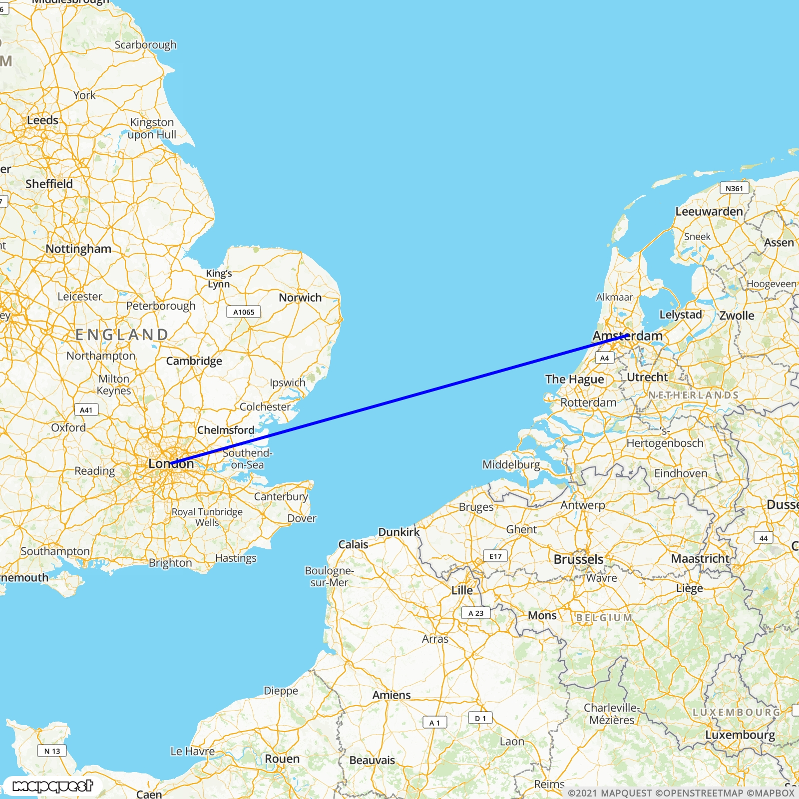

# bash-visual-traceroute
Visualize the `traceroute` command on UNIX based operating systems like Linux, BSD and Mac. Visualize individual hops that your traffic takes around the globe on a map. This can be advantageous to see how traffic is routed when using a VPN. Only for Linux/BSD/Mac.

### Usage
```
./main.sh google.com
```
This bash script only takes one argument, namely the destination target domain.

### Examples
This is the route when connecting to namecheap.com from amsterdam
